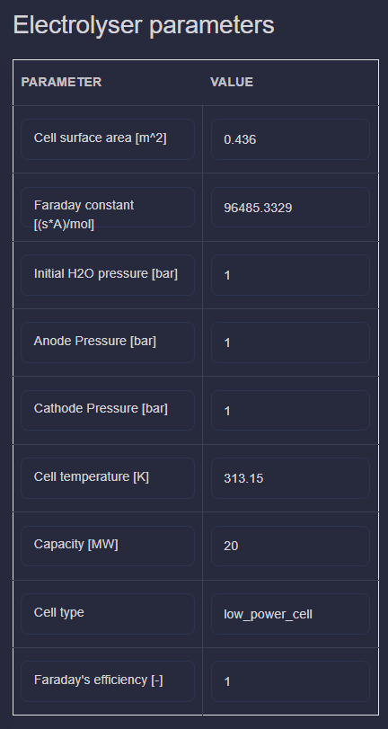

Scenario Analysis Application
==============================

This application provides scenario analysis for operational P2X system both simulation and optimisation. In this Beta version, the layout has been configured and no flexible layout modification is allowed.

Power to Hydrogen Scenario
---------------------------

In this case study, the Power to Hydrogen system consists of:

- electricity source generated by profile (e.g. wind speed or solar radiation).

- electricity demand

- electrolyzer

- hydrogen storage

- hydrogen demand

Scenario Management
~~~~~~~~~~~~~~~~~~~~~~

Before running simulation and optimisation, user needs to defined the component parameters, boundary conditions (input profiles) and control input.
By scenario_default, all parameters has been filled in. User is able to modify this value by creating new scenario. Scenario_default can't be modified or deleted.

User can add new scenario by clicking new scenario button. User can choose the new scenario name and copy value from other scenario.

Component Parameters
~~~~~~~~~~~~~~~~~~~~~~

User needs to fill the electrolyzer parameters and hydrogen storage parameters

Input Profiles
~~~~~~~~~~~~~~~~~~~~~~

There are 3 boundary conditions needs to be uploaded:

- electricity source profile in MW

- electricity demand profile in MW

- hydrogen profile in kg/h

The CSV example format is here: :download:`example_csv <images/scenario_power_supply.csv>`.

The uploaded profile can be viewed by clicking pulse button

Control Input
~~~~~~~~~~~~~~~~~~~~~~

This Power to Hydrogen scenario analysis support 2 mode: simulation and optimisation. This mode can be selected from switching toggle button.
There are 3 control input needs to be defined:

    - electricity splitter to electricity demand and electrolyzer

    - hydrogen splitter to hydrogen demand and hydrogen storage

    - hydrogen storage output

**Simulation**

User needs to define the control input for all control inputs as profile

**Optimisation**

User needs to define the boundary condition of the control inputs for the optimisation algorithm. Initial value, lower bound and upper bound.

Simulation Run
~~~~~~~~~~~~~~~~~~~~~~

Simulation mode will be selected based on toggle described in the previous section.
Now, user needs to select the time horizon of the simulation and also control input step size.
Click Run button to run simulation/optimisation.

.. image:: images/scenario_p2hydrogen_run.png
    :width: 400px
    :align: center

Depends on the mode, two different popup windows will appear

Simulation

Optimisation

When simulation/optimisation run is finish, another popup window will appear.

Power to Heat Scenario
---------------------------

In this case study, the Power to Heat system consists of:

- electricity source generated by profile (e.g. wind speed or solar radiation).

- electricity demand

- heat pump

- heat source

- heat demand

Scenario Management
~~~~~~~~~~~~~~~~~~~~~~

Before running simulation, user needs to defined the component parameters, boundary conditions (input profiles) and control input.
By scenario_default, all parameters has been filled in. User is able to modify this value by creating new scenario. Scenario_default can't be modified or deleted.

User can add new scenario by clicking new scenario button. User can choose the new scenario name and copy value from other scenario.

Component Parameters
~~~~~~~~~~~~~~~~~~~~~~

User needs to fill the heatpump parameters.

Input Profiles
~~~~~~~~~~~~~~~~~~~~~~

There are 3 boundary conditions needs to be uploaded:

- electricity source profile in MW

- electricity demand profile in MW

- heat demand in MW

The CSV example format is here: :download:`example_csv <images/scenario_power_supply.csv>`.

The uploaded profile can be viewed by clicking pulse button

Control Input
~~~~~~~~~~~~~~~~~~~~~~

This Power to Heat scenario analysis only support 1 mode: simulation.
There are 3 control input needs to be defined:

    - electricity splitter to electricity demand and heatpump

**Simulation**

User needs to define the control input for all control inputs as profile

Simulation Run
~~~~~~~~~~~~~~~~~~~~~~

User needs to select the time horizon of the simulation and also control input step size.
Click Run button to run simulation.

.. image:: images/scenario_p2hydrogen_run.png
    :width: 400px
    :align: center

Simulation

When simulation run is finish, another popup window will appear.

