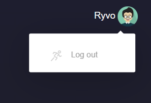

Login Page
================================

The login page can be accessed via web browser using url: http://localhost:5445/. Note: this url is only for local installation. For server implementation, you need to access the IP address or DNS of the machine.

.. image:: images/start_login.png
    :width: 100%

Sign Up
--------------------------------
- If you dont have any account, you can create new account by clicking Sign Up under anonymous tab on the top right panel

- You will be directed to the sign up page.

- Fill in the required information for the new user, such as email address, name, and password.
- Click on the "Sign Up" button.

- If success, you will be redirected to the main page.

- If failed, the error message will be displayed.

Sign In
--------------------------------
- A registered user can log in using their email address and password on the login page.

- After logging in, you will be directed to the main page:

- If failed, the error message will be displayed.

Log Out
--------------------------------
To log out, click on the user icon at the top right corner of the page and select the "Log Out" option.

