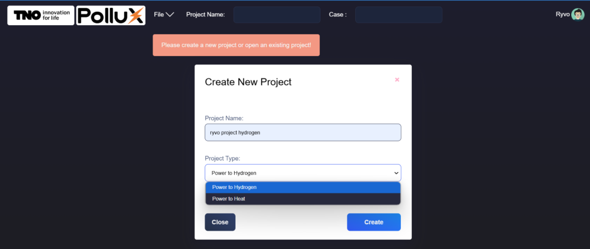
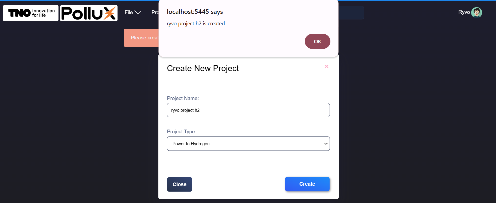
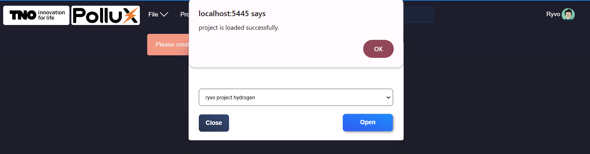
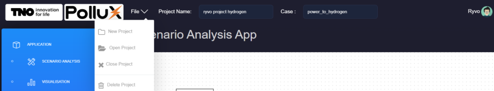
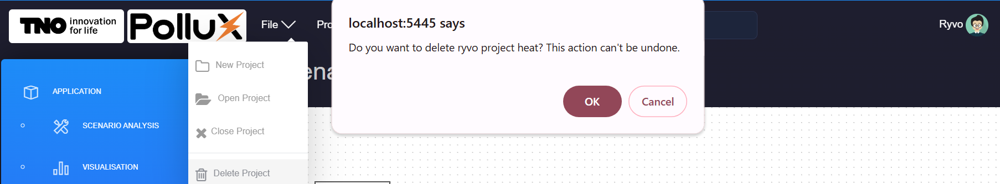
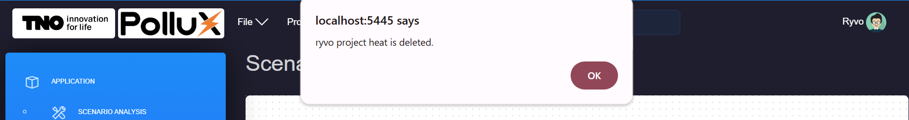

.. _projects:

Projects
===========================

Create New Project
---------------------------

- Click on the "File" icon at the top left corner and select "New Project".

- Enter the name of the project. Select P2X type: Power to Hydrogen or Power to Heat

        
- A confirmation message will appear once the project folder is created successfully.

Open Existing Project
---------------------------

- Click on the "File" icon at the top left corner and select "Open Project".

- Find the name of the projects that are assigned to your account, select the desired project and click "Open".

        
- A confirmation message will appear once the selected project is loaded successfully.

Delete Project
---------------------------

- Open the project (following the steps in the previous section). Click on the "File" icon at the top left corner and select "Delete Project".

- Confirm the deletion when prompted.

- Once confirmed, close the project.

